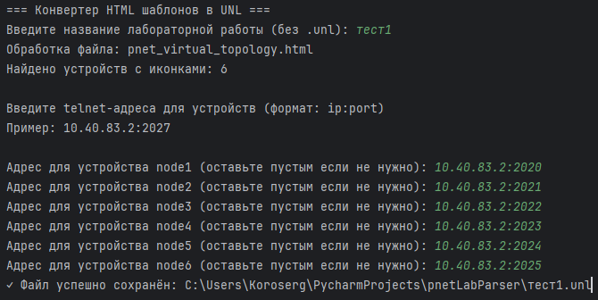

# UNL Generator - Конвертер HTML шаблонов для PNETLab



## 📌 О проекте
Инструмент для автоматического преобразования HTML-шаблонов сетевых топологий в формат `.unl` для использования в PNETLab

## 🚀 Быстрый старт

### Установка
1. Клонируйте репозиторий:
```
git clone https://github.com/ваш-аккаунт/unl-generator.git
cd unl-generator
```
2. Запуск
`python unl_converter.py`

## 🛠 Настройка окружения
1. Шаблоны
Разместите ваши HTML-файлы в папке templates/

2. Иконки устройств
Добавьте в images/icons/ иконки, если необходимо

3. Конфигурация
Основные параметры в коде:
`DEBUG = True  # Генерирует отладочный HTML`

## 🔧 Технические детали
Поддерживаемые элементы
1. Узлы сети (`<div class="node">`)
2. Соединения (`<svg class="jtk-connector">`)
3. Текстовые аннотации
4. Пользовательские иконки
